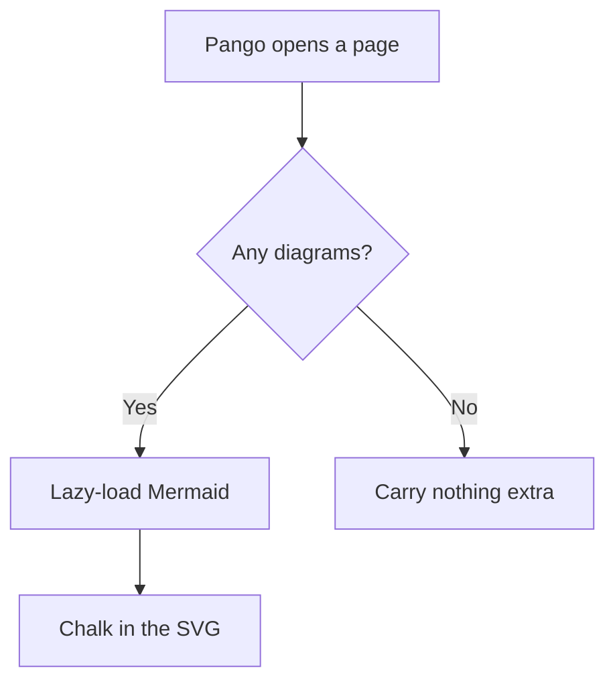
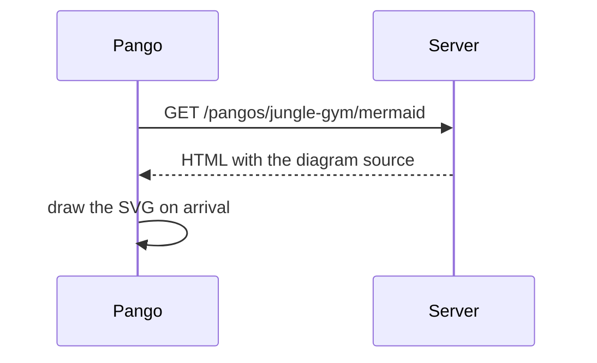
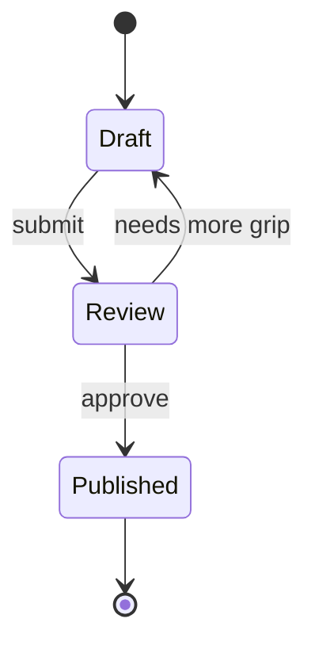

# Diagrams

!!! info "In one line"
    Flowcharts, sequence and state diagrams, and more, written as text in a `mermaid` block and drawn in the browser.

Pango can't climb in a straight line, so he draws maps. When prose would take a paragraph to explain what an arrow shows in a glance, reach for a diagram. docolin renders [Mermaid](https://mermaid.js.org), so you describe the diagram in text and it draws itself.

## How it works

A fence tagged `mermaid` becomes a diagram. The source is rendered on the server as a no-JS fallback first; then, in the browser, Mermaid lazy-loads and swaps in the picture. Readers on pages with no diagram never download the library, so the cost lands only where a diagram is actually used.

## Flowchart

````md

````

!!! cards
    - ```mermaid
      graph TD
          A[Pango opens a page] --> B{Any diagrams?}
          B -->|Yes| C[Lazy-load Mermaid]
          B -->|No| D[Carry nothing extra]
          C --> E[Chalk in the SVG]
      ```

## Sequence diagram

````md

````

!!! cards
    - ```mermaid
      sequenceDiagram
          participant P as Pango
          participant S as Server
          P->>S: GET /pangos/jungle-gym/mermaid
          S-->>P: HTML with the diagram source
          P->>P: draw the SVG on arrival
      ```

## State diagram

A doco's life, from chalk smudge to published bar:

````md

````

!!! cards
    - ```mermaid
      stateDiagram-v2
          [*] --> Draft
          Draft --> Review: submit
          Review --> Published: approve
          Review --> Draft: needs more grip
          Published --> [*]
      ```

Flowcharts, sequence, state, class, entity-relationship, gantt, pie, and the rest of Mermaid's grammar all work; these three just cover the common cases. The full syntax is in the [Mermaid docs](https://mermaid.js.org).

## Theme and nesting

Diagrams re-draw to match the page when a reader flips between light and dark, because Mermaid bakes the colours into the SVG. And a diagram hangs wherever a code block can, inside a [callout](./callouts.md), a [tab](./tabs.md), or an [accordion](./steps-and-accordion.md). One that starts hidden has no width to measure, so it is drawn the moment it is revealed rather than on load.

## Gotchas

- **It's Mermaid syntax, not Markdown.** Inside the fence you follow Mermaid's grammar; a typo there shows an inline error on that one diagram and leaves the rest of the page intact.
- **Keep diagrams small.** A map with forty nodes is harder to read than the paragraph it replaced. If it needs a legend to understand, it is probably too big.
- **The source is the fallback.** Readers without JavaScript see the diagram's text, so write node labels that read sensibly on their own.

## See also

- [Charts](./charts.md), for drawing data rather than relationships.
- [Code blocks](./code-blocks.md), since a Mermaid diagram is just a specially tagged fence.
