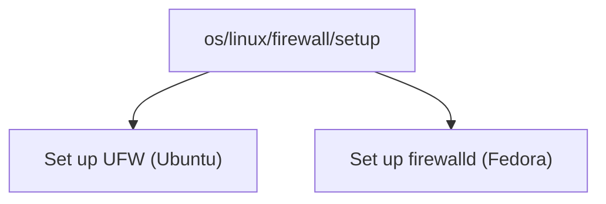

# Kinds and the path taxonomy

!!! info "In one line"
    Every doco has a _kind_: a path like `os/linux/firewall/ufw` that says what it covers and files it next to everything related.

Pango likes a place for everything. A kind is how docolin gives each doco its place: instead of a loose pile of tags, every doco lives at a path:

```
os / linux / firewall / ufw
```

Read it left to right, broad to specific. A path is 2 to 5 segments deep, and the first segment is always one of eleven fixed top-level domains:

`os` · `hardware` · `software` · `data` · `network` · `security` · `cloud` · `devops` · `programming` · `tools` · `blog`

Most explain themselves; the ones worth a gloss: `data` is databases and storage, `tools` is developer tools that aren't tied to an OS, and `blog` is for posts (filed as `blog/{handle}/{slug}`). The [frontmatter reference](../authoring/frontmatter.md#kind-required) spells out what belongs in each.

There's also a sandbox domain, `example`. Docos under `example/` are real and viewable but stay out of search and browse, so it's the place for testing and the [tutorial](../tutorial/overview.md), without cluttering the real taxonomy.

Segments are lowercase, with `-` or `_` for spaces.

## Why a path instead of tags

A path is a _place_, so structure comes for free:

- **Related guides nest.** Everything about Linux firewalls sits under `os/linux/firewall`, so you find the siblings without searching for them.
- **Browsing a path shows the whole subtree.** Open `os/linux/firewall` and you get every guide beneath it, ranked by how well it's verified and how fresh it is.
- **Fallbacks are automatic.** A broader path always contains the narrower ones, so there's a sensible page to land on even before the exact guide exists.

## One kind, many guides

This is where it earns its keep. A single kind can hold several guides for different setups, and a [soft link](./soft-links.md) lists them all, ranked so the best fit for each reader is near the top:



An Ubuntu reader and a Fedora reader follow the same link and land on the same list, but ordered differently: each sees the guide for their machine near the top, ready to pick. The kind is the shared address; [soft links](./soft-links.md) handle the ranking, decided in the reader's own browser once the page loads.

## Choosing a kind

If you're writing, pick the most specific path that's still true and file it under the right domain. You set it once in [frontmatter](../authoring/frontmatter.md), and docolin builds the taxonomy, the browse pages, and the fallbacks from there.
