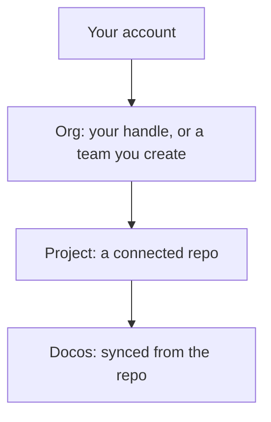

# Accounts, orgs, and projects

!!! info "In one line"
    docolin nests in four pieces: your **account**, the **orgs** you own, the **projects** inside them, and the **docos** inside those. A guide's address is `/{org}/{project}/{path}`.

Pango's corner of docolin nests like a burrow, each space tucked inside a bigger one:

## The pieces

- **Account.** You [sign in](/signin) and pick a handle. That handle is your identity across docolin: your stamps, the docos you wrote, your profile. Choose it with care, a handle is **permanent**. It's woven through every URL and credit, so it can't be changed afterward.
- **Personal org.** Creating your account also creates an org named after your handle. It's your own namespace, ready to hold projects, with nothing extra to set up.
- **Org.** An org owns projects and the docos beneath them. Past your personal one, you can create orgs for a team or a brand, each with its own members and roles (the founder is the admin).
- **Project.** A project connects one repo (and an optional subfolder) to docolin. Its slug is unique within its org and it's the thing that [syncs](./how-sync-works.md). One org can hold many projects. Like a handle, a project's slug is **permanent**, it's part of every doco's URL, so only the display name can change later (docolin may step in only if a slug breaks the [rules](/docolin/docolin/moderation-policy)).
- **Doco.** The pages themselves, synced from a project's repo, each living at `/{org}/{project}/{path}`.

## Names are reserved where it matters

Two kinds of names can't be claimed freely. The top-level [kind domains](../concepts/kinds.md) (`os`, `network`, `security`, and the rest) are reserved so a path always means a topic, never an account. And real-world entity names like `nvidia` or `wikipedia` are held back too. If a reserved name is genuinely yours, you can claim it: file a request, email support from the entity's verified domain quoting your reference id, and an admin confirms the match before it's handed over.

## Everything is public

The content under every org and project is public by design. That is a docolin invariant, not a setting you can flip. The only thing kept private is your own reading, which [never leaves your device](../concepts/privacy.md).
