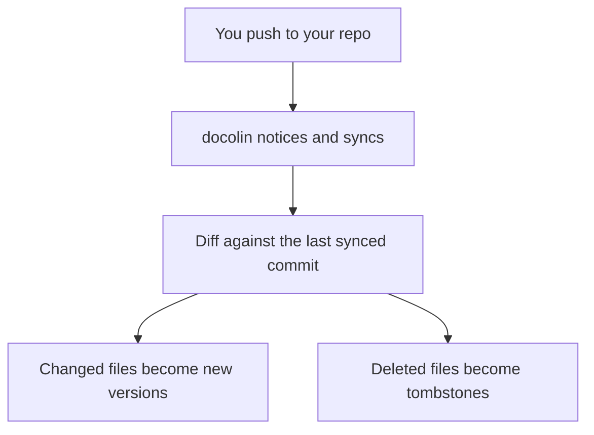

# How sync works

!!! info "In one line"
    docolin keeps a live mirror of your repo's docs: every change you push becomes a new version, and a file you delete becomes a tombstone, not a dead link.

Once a [project is connected](./connect-repo.md), you never open docolin to publish, and Pango never does either. You push to your repo, and docolin reconciles its copy with yours.

## When it syncs

A sync runs in two cases today:

- **The first sync**, the moment you create the project.
- **The scheduled poll**, docolin re-checks every connected repo on a schedule. This is the default and needs no setup. The polling window is **about a day**: a project that hasn't synced in 24 hours gets picked up on the next pass, so a quiet repo refreshes roughly once daily.

Each sync compares your repo against the last commit docolin saw, and only processes what changed. To pull a new commit sooner than the next poll, hit **Refresh** on the project page, or turn on [auto-sync on push](./auto-sync-on-push.md) so a webhook syncs the moment you push. The poll (plus Refresh) is the fallback that keeps everything current.

## Every change is a version

When a doco file changes, docolin writes a **new version** instead of overwriting the old one. So every guide carries its full history, labelled by your git tags (or the commit it came from), and [verification](../concepts/verification.md) is tracked per version: a fresh edit starts earning its own confirmations while keeping the lineage's standing.

## Deleting doesn't break links

Remove a doco from your repo and docolin does not 404 it. The doco becomes a **tombstone**: its URL keeps serving the last version with a banner marking it removed, so every inbound link and AI citation still resolves. Rename a file and docolin follows it to the new path. Nothing a reader or an agent relied on quietly vanishes.

## When a file won't publish

If a file's frontmatter is invalid, docolin skips that one file and records the reason on the project; the rest of the sync still lands. Fix the frontmatter, push again, and it joins the next sync.
