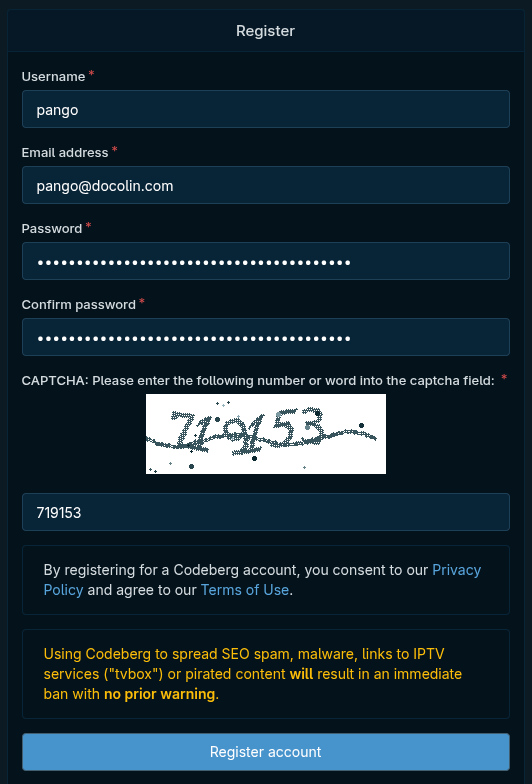
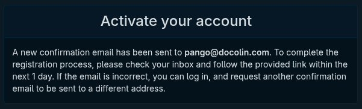
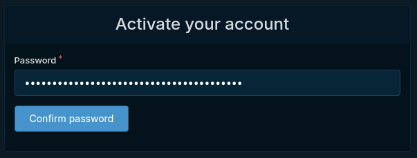
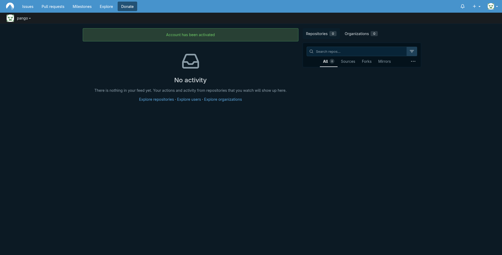

# Make a Codeberg account

Your guides live in a **repository** (a "repo"): a folder a forge hosts for you. We'll use [Codeberg](https://codeberg.org), a community-run, nonprofit home for open source and a fitting place for docs meant to belong to everyone. The first thing you need is an account to own that repo, so that's where Pango starts too.

!!! steps
    1. **Register.** Go to [codeberg.org](https://codeberg.org) and click **Register**. If the page comes up in another language, switch it at the very bottom of the page first. Fill in the form, then click **Register account**.

       

       - **Username** becomes part of every address your guides sit at (`codeberg.org/yourname/...`), so pick one you're happy to share. Pango went with `pango`.
       - **Email address** should be one you can open in a minute.
       - **Password** and **Confirm password**, and do save this one somewhere. Pango didn't, and had to reset it before he'd written a single word. Don't be Pango.
       - **CAPTCHA**, just type the wobbly number it shows.

    2. **Check your inbox.** Codeberg sends a confirmation link and shows this notice until you click it:

       

    3. **Activate.** Open the email and click its link. That drops you back on Codeberg, which asks for your password once more to be sure it's you. Type it in and click **Confirm password**.

       

    4. **You're in.** A green _Account has been activated_ banner, an empty feed, and zero repositories. We make one in the next step.

       

??? "Prefer GitHub?"
    Go to [github.com](https://github.com), click **Sign up**, and follow the prompts: email, a password, and a username (same role as the Codeberg one above), then a code GitHub emails you to confirm. The free plan is all you'll ever need here. You'll land on your GitHub home with no repositories yet, then pick the walk back up at the next step.
