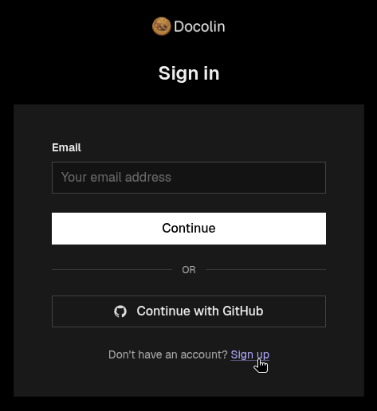
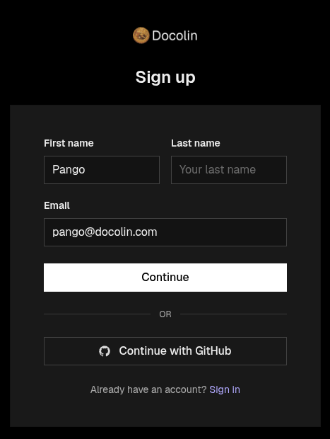
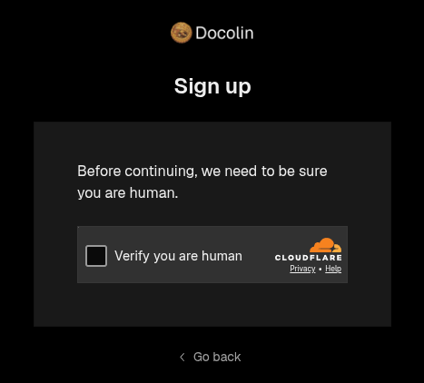
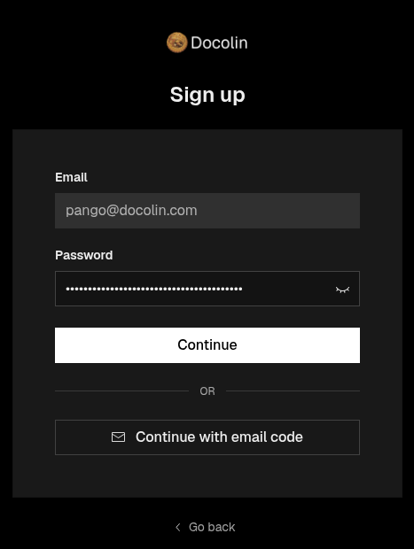
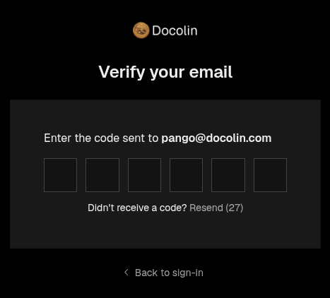
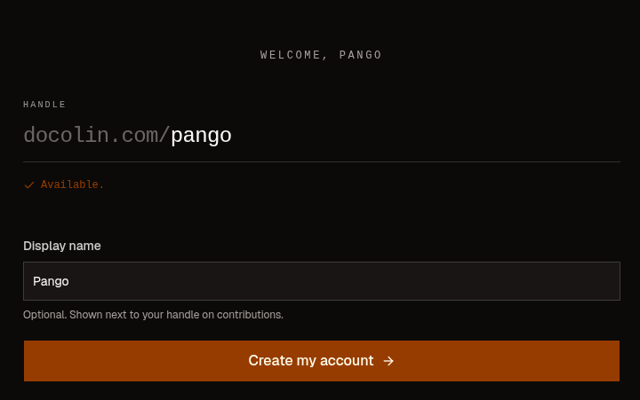

# Make your docolin account

Codeberg holds your files. **docolin** is the platform that reads them, renders them into real pages, and lets people and AIs verify them. They're separate accounts, so let's make your docolin one **now**, before you write your guide, so your handle is settled when you do. Whatever you pick here is what you'll put in the guide's `handle:` field, and it's what credits the guide to you. Pango picked `pango`.

!!! steps
    1. **Start the sign-up.** Open docolin's [**sign-in** page](/signin), then click **Sign up** at the bottom.

       

    2. **Name and email.** Enter your first name and an email you can open in a minute, then **Continue**. (Pango signs up as `pango@docolin.com` because he's on the docolin team, use your own email.)

       

    3. **Confirm you're human.** Tick the Cloudflare check.

       

    4. **Set a password, or skip it.** Choose a password, or click **Continue with email code** to sign in with a one-time code each time instead, no password to remember. Then **Continue**.

       

    5. **Confirm you're human again.** The Cloudflare check runs once more after the password, tick it again. (Yes, twice, that's just how the sign-up flows.)

    6. **Enter the code.** docolin emails you a short code, type it in.

       

    7. **Claim your handle.** Your name and email carry over from sign-up. Your **handle** is your name across docolin, pick one you like, it's **permanent**. Add a display name if you want, then click **Create my account**. (Pango picked `pango`, so his screen reads `docolin.com/pango`.)

       

??? tip "Used GitHub for your repo?"
    You'd have a **Continue with GitHub** button on the sign-in screen and be in with a single click, no password and no email code. Any forge works with docolin; GitHub just happens to double as a sign-in.

That's your docolin identity, and it's what every guide you publish and every verification you leave gets credited to. With your handle settled, on to the fun part: your first guide.
