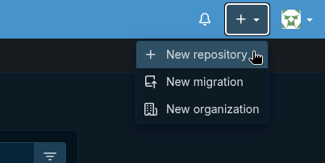
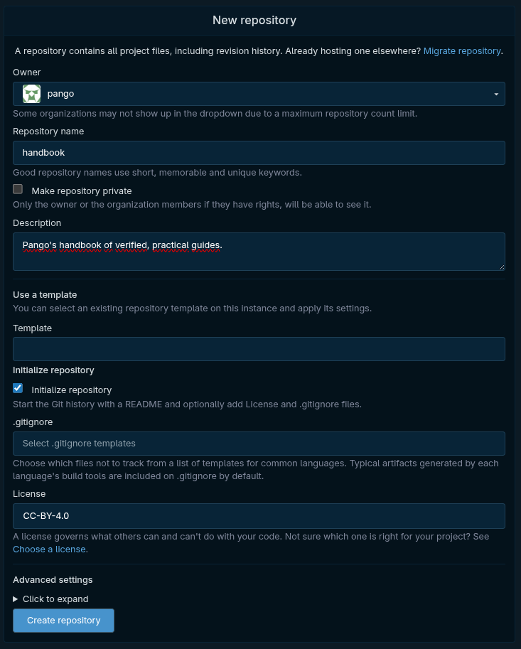
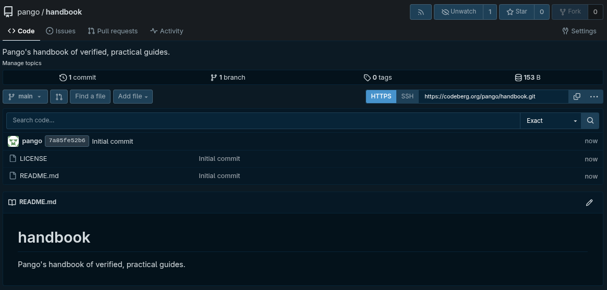
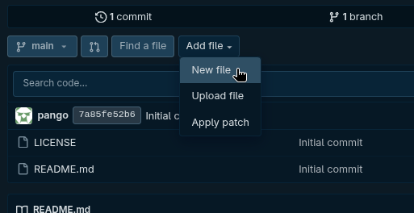
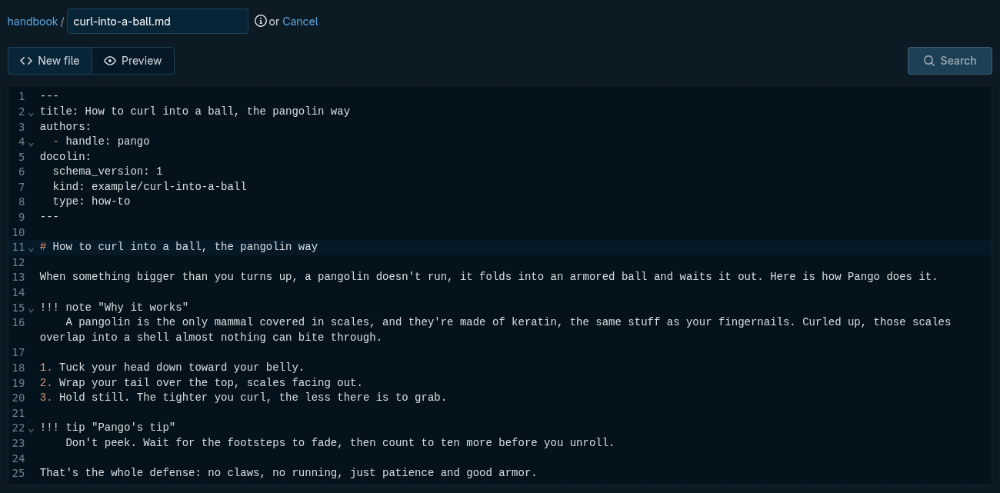
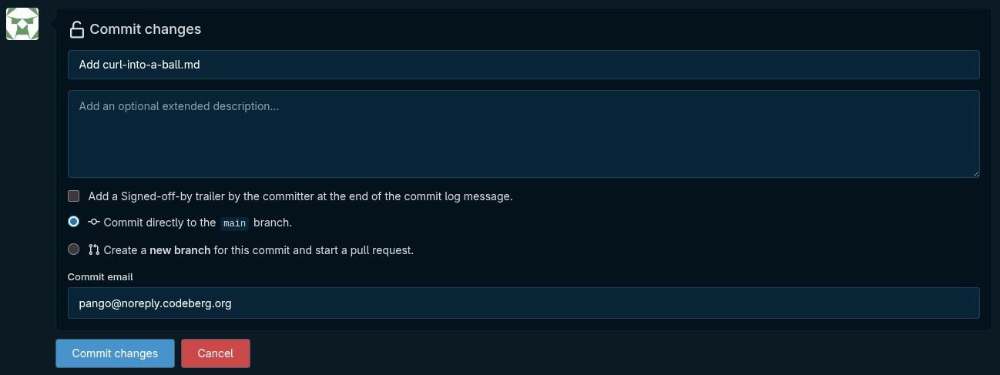
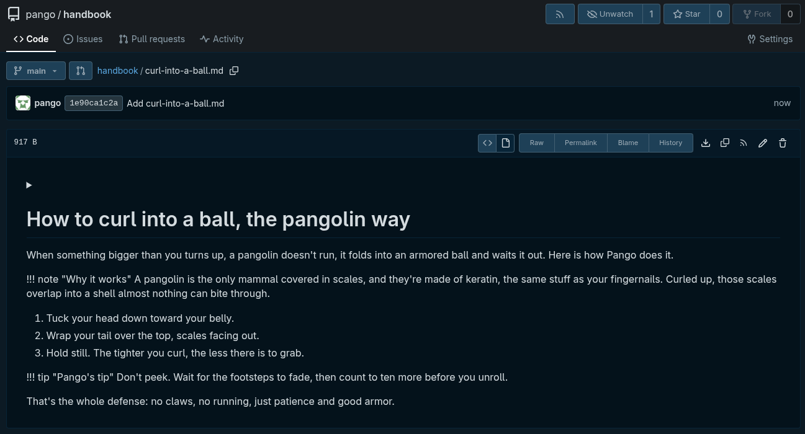
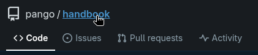
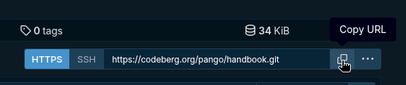

# Write your first guide

You have both accounts now, Codeberg and docolin. Next you head **back to Codeberg** to make a **repository** for your guides and write your first one, with your docolin handle already on it. A guide is just a Markdown file, so there is nothing to install.

## Make the repository

!!! steps
    1. **New repository.** At the top-right, click the **+** and choose **New repository**.

       

    2. **Fill it in,** then leave the rest at its defaults.

       

       - **Repository name** lands in every guide's address (`docolin.com/pango/<repo>/...`), so keep it short. Pango used `handbook`.
       - Leave **Make repository private** unticked. docolin only reads public repos (and your content on docolin is public by design anyway).
       - **Description** is optional, a one-line summary of the repo. Pango wrote "Pango's handbook of verified, practical guides."
       - Tick **Initialize repository** so it isn't completely empty; it adds a README.
       - **License** is worth a thought: a guide is prose, not code, so a _content_ license fits better than a software one. Pango chose **CC-BY-4.0** (reuse it freely, just credit the author), which matches docolin's attribution-first spirit. `CC-BY-SA-4.0` is the "keep it open" variant, and you can also leave it blank for now.

    3. **Create repository.** You land on the repo's front page, already holding a README and a LICENSE.

       

## Write the guide

A docolin guide is one Markdown file. The part between the `---` fences at the top is the **frontmatter**: a small label that tells docolin what the page is. Everything below it is the guide. Here is Pango's, you'll paste it in a moment:

```markdown
---
title: How to curl into a ball, the pangolin way
authors:
  - handle: pango
docolin:
  schema_version: 1
  kind: example/curl-into-a-ball
  type: how-to
---

# How to curl into a ball, the pangolin way

When something bigger than you turns up, a pangolin doesn't run, it folds into an armored ball and waits it out. Here is how Pango does it.

!!! note "Why it works"
    A pangolin is the only mammal covered in scales, and they're made of keratin, the same stuff as your fingernails. Curled up, those scales overlap into a shell almost nothing can bite through.

1. Tuck your head down toward your belly.
2. Wrap your tail over the top, scales facing out.
3. Hold still. The tighter you curl, the less there is to grab.

!!! tip "Pango's tip"
    Don't peek. Wait for the footsteps to fade, then count to ten more before you unroll.

That's the whole defense: no claws, no running, just patience and good armor.
```

Two fields matter before you commit:

- **`authors`** is the one thing you **must change**: swap `pango` for the handle you just claimed on docolin. It's what credits the guide to you, which is why we settled it first.
- **`kind: example/...`** files it in docolin's **sandbox**: real and viewable, but kept out of search and browse so practice guides don't clutter the place. Swap it for a real path (like `fitness/gymnastics/dismount`) when you write something to keep.

Now add it to the repo (changing the handle as you paste):

!!! steps
    1. **New file.** Click **Add file**, then **New file**.

       

    2. **Name it and paste.** In the filename box type `curl-into-a-ball.md` (the `.md` ending matters), then paste the guide above into the editor and **swap the `pango` after `handle:` for the handle you claimed on docolin**.

       

    3. **Commit it.** Scroll down to **Commit changes**, right under the editor. There's no default message, so type a short one like `Add curl-into-a-ball.md`, leave **Commit directly to the main branch** selected, and click **Commit changes**.

       

## See it, and what's missing

Your guide is live on Codeberg now:



Notice the `!!! note` and `!!! tip` lines show up as **plain text** here. That's expected: those are _docolin's_ syntax, not Codeberg's, so the forge prints them literally. On docolin they render as proper callouts. That gap is the whole point: the same file is a plain document on the forge and a rich, verified page on docolin.

## Grab the repo's address

One last thing before the next step. Click **handbook** in the breadcrumb to go back to the repo's front page:



With **HTTPS** selected, click the copy button next to the address (`https://codeberg.org/pango/handbook.git`):



That address is what you'll hand docolin in the next step, where your guide finally goes from a file in a repo to a published, verifiable page.
