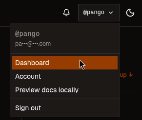
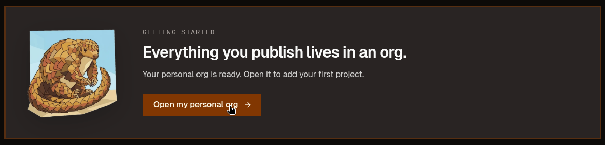
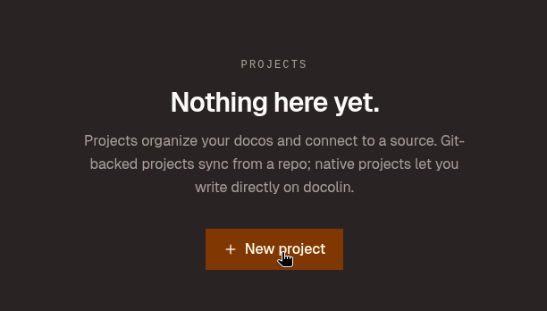
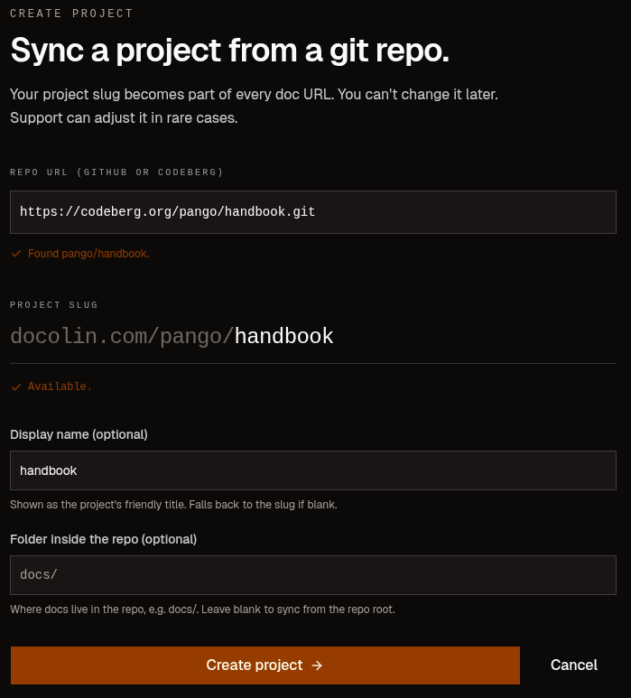
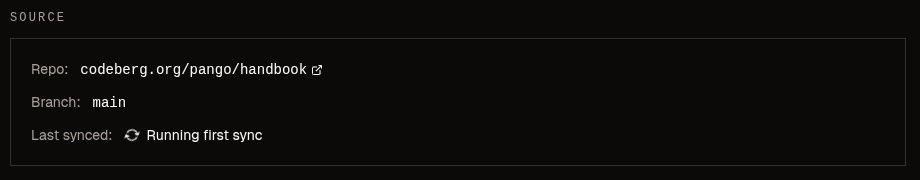
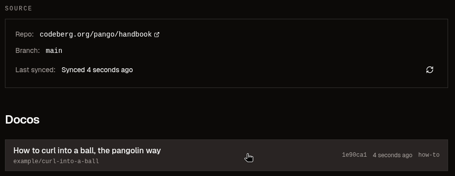
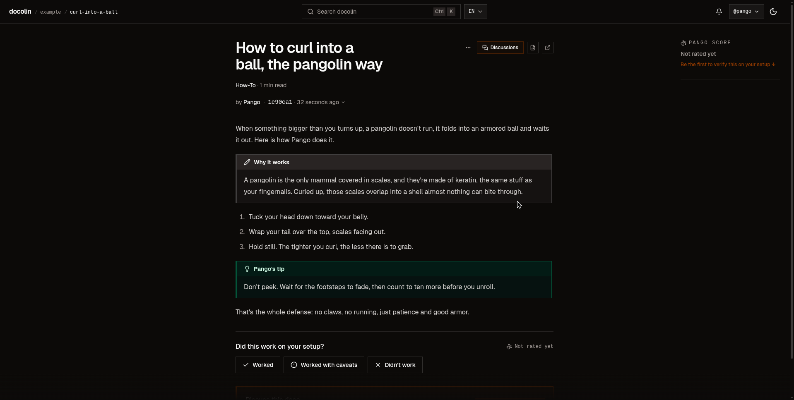

# Publish your guide

You have a guide in a repo and an account on docolin. Time to connect the two so docolin reads your repo, renders your Markdown, and your guide goes live. Head over to **docolin** to wire it up.

## Connect your repo

!!! steps
    1. **Open your dashboard.** Click your handle at the top-right, then **Dashboard**.

       

    2. **Open your org.** Everything you publish on docolin lives in an **org**, a home for your projects. You already have a personal one, so open it.

       

    3. **New project.** A **project** is one repo connected to docolin. You have none yet, so click **New project**.

       

    4. **Point it at your repo.** Paste the repo address you copied. docolin checks it and confirms it found your repo. Leave the **Folder inside the repo** field blank, your guide sits at the repo's root. Then click **Create project**.

       

       Your **project slug** (`handbook` for Pango) becomes part of every guide's URL and is **permanent**, like your handle, so it's worth getting right.

## Watch it sync

docolin reads your repo and turns every valid Markdown file into a doco. The first sync takes a few seconds:

Moments later it's done, and your guide shows up in the project's **Docos** list:

## See it live

Click the guide to open it on docolin. This is the moment it all pays off:

Look at what changed from the raw file on the forge:

- The `!!! note` and `!!! tip`, plain text on Codeberg, are now **real callouts**: a boxed _Why it works_ and a green _Pango's tip_.
- It's **credited to you** (here, _by Pango_), because the `handle` in the frontmatter resolved to your docolin account.
- On the right sits the **Pango score**: _Not rated yet. Be the first to verify this on your setup._ That's verification, and it's the next step.

Same file, two faces: a plain document on the forge, and a rich, attributed, verifiable page on docolin. Your guide is published.
