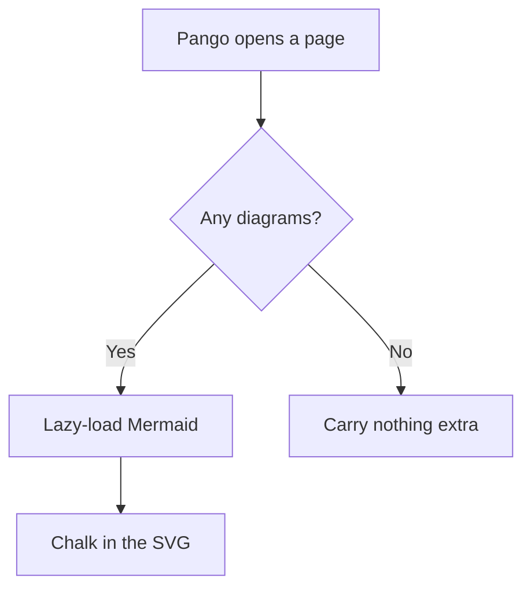
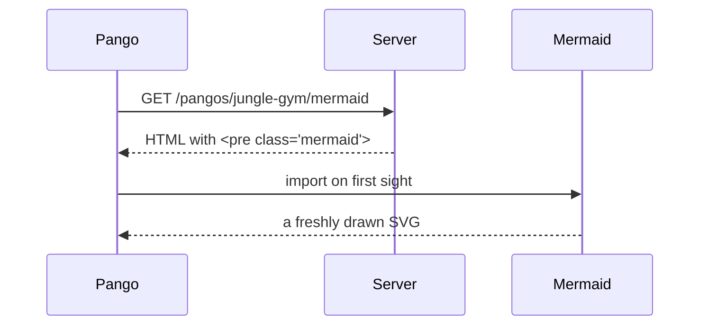
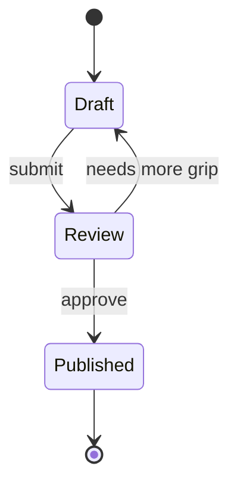

Pango can't climb in a straight line, so he draws maps. A ` ```mermaid ` fence
turns into a diagram: the source is server-rendered as a no-JS fallback, then
Mermaid lazy-loads in the browser and swaps in the picture. Climbers on pages
with no diagram never carry the extra rope.

## Flowchart

How Pango decides whether a page needs a map at all:



## Sequence diagram

The same trip, bar by bar:



## State diagram

A doco's life, from chalk smudge to published bar:



## Theme follows the gym

Flip the lights with the toggle in the navbar. Every diagram re-chalks so its
colors match light or dark, because Mermaid bakes the theme straight into the SVG.

## Inside other apparatus

A map hangs wherever a code block does. A diagram in a tab or accordion starts
hidden, where its box has no width for Mermaid to measure, so it's drawn the moment
you reveal it, not on load.

In a callout:

!!! tip "The pipeline, at a glance"
    ```mermaid
    graph LR
        Parse --> Highlight --> Sanitize --> Render
    ```

In tabs, where the second and third diagrams draw on first switch:

=== "Flow"
    ```mermaid
    graph TD
        Start --> Climb --> Top
    ```

=== "Sequence"
    ```mermaid
    sequenceDiagram
        Pango->>Bar: grab
        Bar-->>Pango: hold
    ```

=== "State"
    ```mermaid
    stateDiagram-v2
        [*] --> Hanging
        Hanging --> Resting
    ```

In an accordion, each diagram drawn the moment its row opens:

!!! accordion
    - **The climb up**

      ```mermaid
      graph LR
          Ground --> Bar1 --> Bar2 --> Top
      ```

    - **The climb down**

      ```mermaid
      graph RL
          Top --> Bar2 --> Bar1 --> Ground
      ```

## A faceplant

A broken diagram doesn't take the whole gym down with it. Mermaid leaves an inline
error on just this one bar while Pango dusts himself off:

```mermaid
graph TD
    A -->
```
